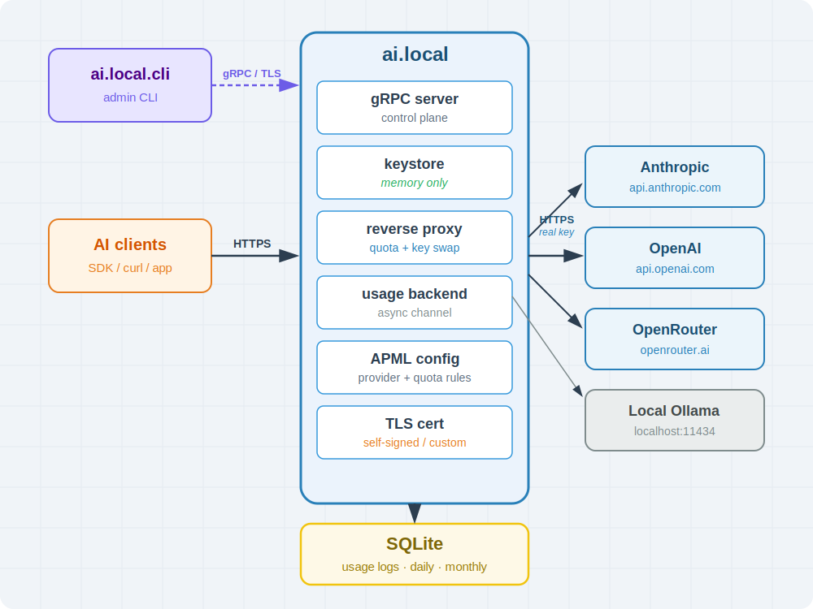

# ai.local
<p align="center">
  
</p>

## What is ai.local?

ai.local is a lightweight, self-hosted AI Gateway that sits between AI clients and AI providers.

It allows organizations to securely expose AI services to employees and applications without distributing real provider API keys, while providing a centralized control point for AI access and management.

## Key Features

### 🔐 Internal API Keys

Users never receive the real AI provider API keys.

Administrators register provider credentials through `ai.local.cli`, and users only receive internally generated API keys. The gateway maps internal keys to the configured provider and route.

### 💾 In-Memory Provider Credentials

Provider API keys are stored only in memory.

They are never written to configuration files, databases, or persistent storage.

After a restart, administrators must reload provider API keys for each route. This is an intentional security design to minimize the risk of credential leakage.

### 📊 Quota Enforcement

Each route can define its own quota policy through APML.

Supported quota modes include:

* Per-key quota
* Shared quota
* Daily token limits
* Monthly token limits

### 🔄 Flexible AI Routing

Clients access AI services through routes such as:

```
https://ai.local/openai
https://ai.local/claude
https://ai.local/graphic
```

Each route can point to a different AI provider or an internal AI service.

### 🧩 APML-Based Provider Definition

APML allows administrators to define:

* AI provider endpoints
* Token estimation rules
* Request and response mappings
* Custom AI servers
* Quota policies

This makes it possible to support OpenAI-compatible services as well as proprietary internal AI platforms.

### 🔒 Secure Remote Administration

`ai.local.cli` communicates with the gateway through a TLS-protected gRPC channel, allowing both local and remote administration.

Administrators can securely:

* Register provider API keys for a route
* Generate internal API keys
* Revoke internal API keys
* View usage statistics

## Architecture

ai.local consists of three layers:

**Control plane** — `ai.local.cli` communicates with the gRPC server
over a TLS-protected channel. Administrators inject provider API keys,
manage internal keys, and query usage statistics through this interface.
Provider credentials are held in memory only and never written to disk.

**Data plane** — A Gin-based reverse proxy intercepts HTTPS requests
to `ai.local/*`, validates the internal API key, enforces quota limits,
swaps in the real provider key, and forwards the request to the
upstream AI provider. Token usage is extracted from the response and
emitted asynchronously to the storage layer.

**Storage layer** — SQLite running in WAL mode records immutable usage
logs and maintains cached daily and monthly token totals per key per
route. These totals serve as the fast lookup for quota pre-checks on
each incoming request.

Provider routing rules, quota policies, and token field mappings are
all defined in an APML configuration file loaded at startup.

## Quick Start

This guide demonstrates how to deploy the `ai.local` gateway binary directly on an internal Linux server within your company network.

### Prerequisites

Before deploying `ai.local`, ensure your environment meets the following requirements:

* **Operating System**: A Linux server (Ubuntu/Debian/RHEL) with `root` or `sudo` privileges.
* **Build Toolchain**: 
  * **Go**: Version 1.26.4 or higher installed (to compile the core source code).
  * **Make**: `make` utility installed (for executing build automation).
* **Binaries Deployment**: The `ai.local` (gateway) and `ai.local.cli` (control-plane) binaries compiled locally from source and placed into your system executable path (e.g., `/usr/local/bin/`).

---

### 🏗️ Building From Source (Alpha Stage)

Since the project is in its active alpha phase and tags have not been pushed yet, you can compile and deploy the binaries directly from the repository source:

```bash
# 1. Clone the repository and navigate to the root directory
git clone https://github.com/RainbowCloudLabs/ai.local
cd ai.local

# 2. Compile the binaries using Makefile
make

# 3. Manually deploy to your system executable path
sudo cp ai.local ai.local.cli /usr/local/bin/
sudo chmod +x /usr/local/bin/ai.local /usr/local/bin/ai.local.cli
```
### Internal DNS Configuration

Before starting the gateway, your organization's internal DNS server (such as BIND, dnsmasq, or Windows Server DNS) must be configured to resolve the domain name specified in your APML `baseUri` (`https://ai.local`) to the private IP address of the Linux server where `ai.local` is deployed.

For local development or staging tests on a single machine, you can append this mapping directly to the host's `/etc/hosts` file:

```
# Append to /etc/hosts on client machines for quick evaluation
192.168.1.4  ai.local
```
---
### Provision Infrastructure Directory & Config

Create the production data directory to store your SQLite database and security credentials. You must place your crafted `ai.local.apml` file into this folder before powering up the engine.

> 📘 **Configuration Reference**: Before drafting your layout, please review the complete rule system in the [AMP Specification](./docs/APML-Spec.md).

```
# 1. Establish the configuration iron curtain
sudo mkdir -p /etc/ai.local

# 2. Initialize your APML deployment policies
sudo vi /etc/ai.local/ai.local.apml
```


---

### TLS Credentials Initialization

Because the data plane intercepts HTTPS requests and the control plane secures gRPC traffic, valid TLS credentials are mandatory. 

You can let the `ai.local` engine automatically provision high-grade self-signed certificates into your data directory with a single command:

```
# Generate ai.local.crt and ai.local.key automatically
sudo ai.local -d /etc/ai.local -gen-cert
```

> 💡 *Note: Alternatively, you can manually drop your own enterprise OpenSSL or ACME-managed certificates (`ai.local.crt` and `ai.local.key`) directly into `/etc/ai.local`.*

---

### Fire Up the Data-Plane Engine

Since binding to the standard HTTPS port (`:443`) requires elevated privileges on Linux, use `sudo` to launch the server core. Route it to your data directory to lock in the configuration and active credentials:

```
# Energize the gateway on standard HTTPS interface
sudo ai.local -d /etc/ai.local --proxy-addr :443
```

Once running, the core engine will output:
```
ai.local engine initialized: version draft — gateway base URI: [https://ai.local](https://ai.local)
[Control Plane] gRPC server secure plane armed at :50051
[Data Plane] HTTPS Reverse Proxy reverse routing running at :443
```

---

### Remote Administrative CLI Connection

On the administrator's workstation (Remote PC), configure the environment variable to target the newly deployed gRPC control plane. This bypasses the need to repeatedly input the `-addr` flag:

#### 🐧 Linux & 🍏 macOS (Bash / Zsh)
```bash
export AI_LOCAL_ADDR="192.168.1.4:50051"
./ai.local.cli route list
```

#### 🪟 Windows PowerShell
```powershell
$env:AI_LOCAL_ADDR="192.168.1.4:50051"
.\ai.local.cli.exe route list
```

Now, the remote infrastructure is fully interconnected. You can safely feed provider API keys into memory and provision internal keys for your team.

> 📘 **Command Reference**: For a comprehensive guide on managing routes, keys, and usage metrics via the command line, please review the [ai.local.cli documentation](./docs/cli.md)


---

## 🚀 Ready-to-Run Examples

The repository provisions fully functional, production-ready configurations and client client testing scripts within the `examples/` directory.

```text
examples/
├── openai/       # Config and Python scripts tailored for api.openai.com
└── openrouter/   # Config and Bash scripts tailored for openrouter.ai
```
To fire up the gateway engine and run test scenarios immediately using these environments, please check out the complete step-by-step guide in [docs/ai-examples.md](./docs/ai-examples.md).

---

## 🐋 Docker Deployment (Alpha Staging)

If you prefer containing the gateway within an isolated container ecosystem, you can utilize the local Docker build and export trajectory.

###  Build and Load Local Image

Since the project is in alpha, you can package the engine into a local tarball and host-load it without pushing to an external registry:

```bash
# Compile and export the image to a tarball file
make docker-export

# Load the alpha image into your host's local docker daemon
sudo docker load < ai.local-alpha.tar
```

### Energize the Container Engine

Launch the container with host-mapped ports and configuration iron curtains locked into position:

```bash
sudo docker run -d \
  --name ai-gateway \
  -p 443:8443 \
  -p 50051:50051 \
  -v ${HOME}/ai-gateway:/etc/ai.local \
  ai.local:latest
```

> 💡 **Note**: Make sure your `ai.local.apml` and generated TLS certificates are properly placed inside `${HOME}/ai-gateway` on the host machine before running the container.
